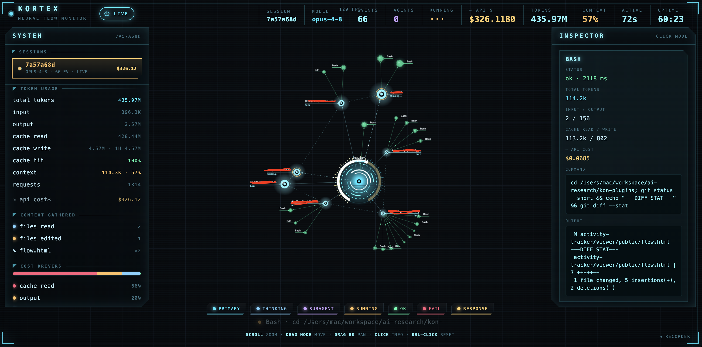

# Activity Tracker — KORTEX

**Watch what Claude Code is doing, live.** A plugin that animates your session as a flow
graph — prompts, tools, and the parallel subagent tree — with zero-config token, cost, and
context tracking from the transcript. Pure Node, zero dependencies, local-only.



## Install

```
/plugin marketplace add chicongst/kortex
/plugin install activity-tracker
```

Restart Claude Code, then open **http://127.0.0.1:39000/flow.html**. The viewer autostarts
on every session — nothing else to run.

**Tip:** in `/plugin` → **Marketplaces** → `kortex`, enable **auto-update** so future
versions arrive automatically.

## What you get

- **Flow graph** — each prompt branches into its tools and subagents; newest is biggest.
- **Context gauge** — a ring that fills cyan → amber → red as the window fills up.
- **Cost & tokens** — per-node and per-session, read from the transcript. No setup.
- **Sessions switcher + inspector** — click any node for its token/cost breakdown.

## Turn it off / on

`/activity-tracker off` (or `on`, `status`), or the **⏻** button in the viewer. Persists
across sessions; while off, nothing is sent and the viewer won't autostart.

## Update

```bash
claude plugin update activity-tracker@kortex   # then /reload-plugins (or restart)
```

Or, in `/plugin` → **Installed** → `activity-tracker` → **Update**.

## Troubleshooting

Viewer won't open? The autostart runs in a non-interactive shell, so a Node installed via
nvm/fnm/volta/asdf may not be on `PATH`. It's resolved from common locations and logged:

```bash
cat ~/.claude/activity-tracker-viewer.log    # why it did / didn't start
node "$CLAUDE_PLUGIN_ROOT/viewer/server.js"   # start it by hand
```

Local-only by design (binds `127.0.0.1`). To view from another machine, tunnel it:
`ssh -L 39000:127.0.0.1:39000 user@host`.

## Optional: live API errors via OpenTelemetry

```bash
export CLAUDE_CODE_ENABLE_TELEMETRY=1
export OTEL_METRICS_EXPORTER=otlp
export OTEL_EXPORTER_OTLP_PROTOCOL=http/json
export OTEL_EXPORTER_OTLP_ENDPOINT=http://127.0.0.1:39000
```

Adds 429/529/retry signal the transcript lacks. Not required for cost/tokens.

## Develop

```bash
node --test test/*.test.js       # tests
node viewer/server.js &          # run the viewer
node test/simulate.js            # fake a session to watch it animate
```
